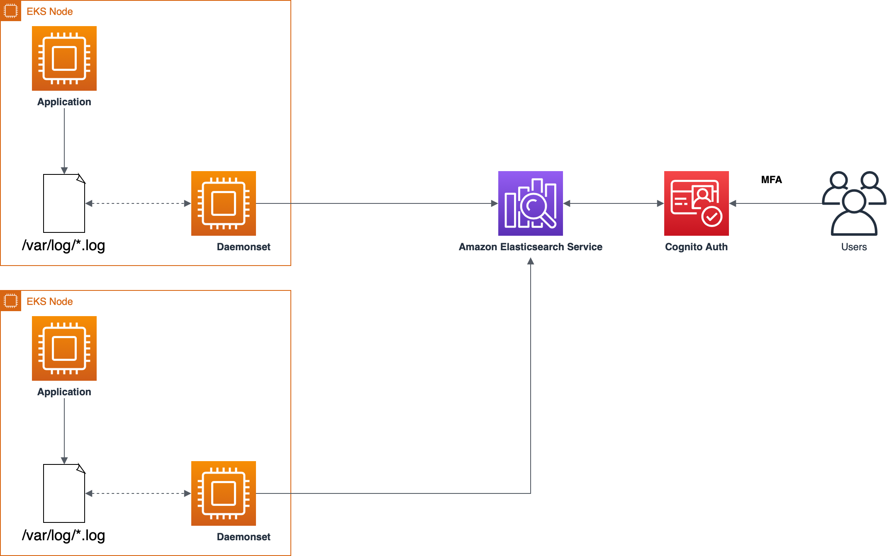
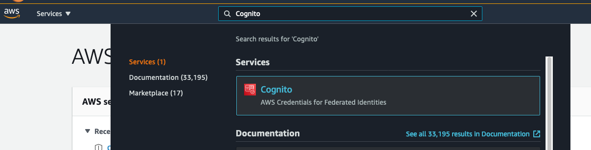
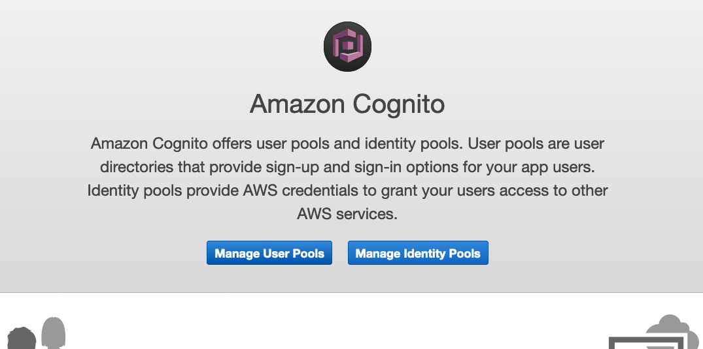
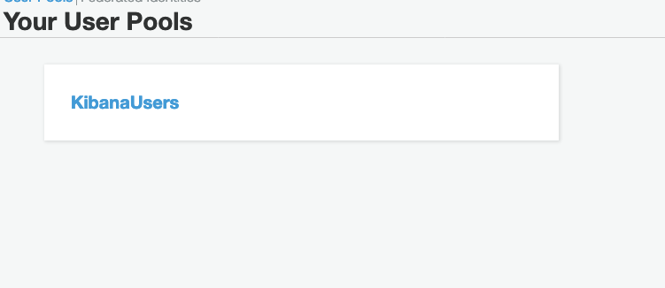
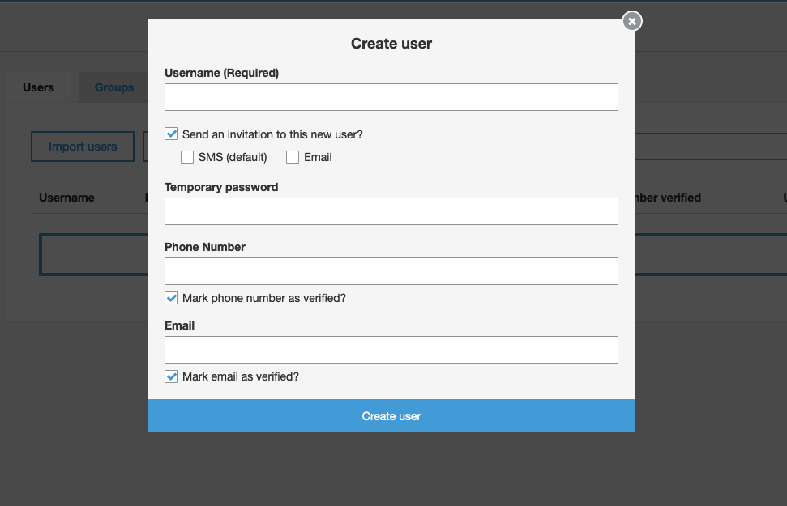
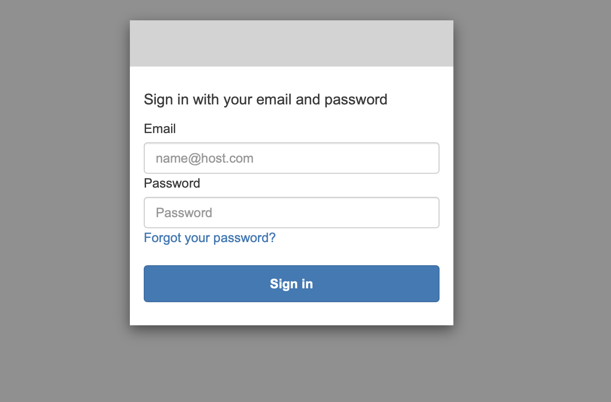

# Kubernetes Log Shipping

This demonstration has the purpose of presenting how you can easyly integrate EKS logs with Amazon Elasticsearch service and secure the access to the logs using Amazon Cognito.

## Architecture


<p align="center"> 

</p>

**This demonstration was tested in us-east-1 region**

## Pre Reqs

- eksctl
- awscli
- kubectl

## Provision EKS cluster

We are going to use eksctl to provision our EKS cluster for this demonstration, eksctl will provision the Kubernetes master, nodes and **also the VPC**.

```shell
eksctl create cluster -f kubernetes-cluster-us-east-1.yaml
```

Now we have to configure our `~/.kube/config` file in order to access our cluster using kubectl.

```shell
aws eks --region us-east-1 update-kubeconfig --name kubelogs-cluster
```

This will update your kube config file, now let's test if we can access our cluster.

```shell
kubectl get nodes
```

## Fluent-bit IAM Role for Service Account 

To use IAM roles for service accounts in your cluster, we will first create an OIDC identity provider.

```shell
eksctl utils associate-iam-oidc-provider \
    --cluster kubelogs-cluster \
    --approve
```

Next, we will create an IAM policy that limits the permissions needed by the Fluent Bit containers to connect to the Elasticsearch cluster. We will also create an IAM role for your Kubernetes service accounts to use before you associate it with a service account.

```shell

export ES_DOMAIN_NAME="es-eks-log-demo"
export ACCOUNT_ID="your aws account id"
export AWS_REGION="your aws region"

cat <<EoF > ./fluent-bit-policy.json
{
    "Version": "2012-10-17",
    "Statement": [
        {
            "Action": [
                "es:ESHttp*"
            ],
            "Resource": "arn:aws:es:${AWS_REGION}:${ACCOUNT_ID}:domain/${ES_DOMAIN_NAME}",
            "Effect": "Allow"
        }
    ]
}
EoF

aws iam create-policy   \
  --policy-name fluent-bit-policy \
  --policy-document file://./fluent-bit-policy.json
```

Finally, create an IAM role for the fluent-bit Service Account in the logging namespace.

```shell
kubectl create namespace logging

eksctl create iamserviceaccount \
    --name fluent-bit \
    --namespace logging \
    --cluster eksworkshop-eksctl \
    --attach-policy-arn "arn:aws:iam::${ACCOUNT_ID}:policy/fluent-bit-policy" \
    --approve \
    --override-existing-serviceaccounts
```

## Creating our Amazon Elasticsearch cluster with Cognito integration

In this repository you will find a CloudFormation template that will create all the components that we need to integrate Amazon Elasticsearch with Amazon Cognito.

```shell
aws cloudformation create-stack \
    --stack-name kubelogs-es-stack \
    --template-body file://cludformation/stack.yaml \
    --capabilities CAPABILITY_IAM \
    --region us-east-1 \
    --parameters ParameterKey=ArnFluentBit,ParameterValue={FLUENT_BIT_ROLE_ARN}
```

## Create Fluent-bit DaemonSet on Amazon EKS

Let’s start by downloading the fluentbit.yaml deployment file and replace some variables.

```shell
export ES_ENDPOINT=$(aws es describe-elasticsearch-domain --domain-name ${ES_DOMAIN_NAME} --output text --query "DomainStatus.Endpoint")

curl -Ss https://www.eksworkshop.com/intermediate/230_logging/deploy.files/fluentbit.yaml \
    | envsubst > ./fluentbit.yaml
```

Explore the file to see what will be deployed. The fluent bit log agent configuration is located in the Kubernetes ConfigMap and will be deployed as a DaemonSet, i.e. one pod per worker node. In our case, a 3 node cluster is used and so 3 pods will be shown in the output when we deploy.

```shell
kubectl apply -f ./fluentbit.yaml
```

Wait for all of the pods to change to running status.

```shell
kubectl --namespace=logging get pods
```

## Creating Cognito User to Access Kibana Dashboard

Access the AWS console and search for Cognito in services.

<p align="center"> 

</p>

Click on Manage User Pools.

<p align="center"> 

</p>

Access the UserPool `KibanaUsers`.

<p align="center"> 

</p>

Select Users and groups and Create user.

<p align="center"> 

</p>

Fill the requireds and click on `Create user`.

## Access Kibana Using Your Cognito User

Get the Kibana URL.

```shell
echo 'https://'$ES_ENDPOINT'/_plugin/kibana/'
```

The Cognito screen will show up, access it using your user created before.

<p align="center"> 

</p>

Now let's create the Index Pattern that we will use for discover.

To create index patterns, complete the following steps:

- On the navigation panel, choose `Stack Managment` to open the Management page.
- Choose Index Patterns.
- Choose Create index pattern.
- For Index pattern, enter `fluent-*`.
- For Time filter, choose `@timestamp.`
- Choose Create index pattern.

Now you can Access the `Discover` dashboard and you should see your application logs.


## (Optional) Enable Cognito MFA

If you want to add MFA to your cognito User Pool, follow this [link](./auth_flow/README.md)
## References

https://docs.aws.amazon.com/elasticsearch-service/latest/developerguide/es-cognito-auth.html
https://github.com/aws-samples/amazon-elasticsearch-service-with-cognito/